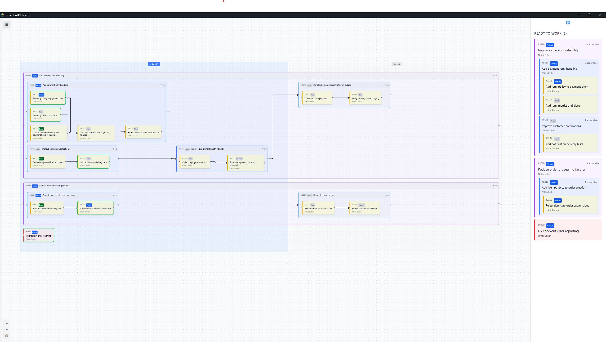

# Decent ADO Board

A desktop app for better managing Azure DevOps work items.

Decent ADO Board turns an Azure DevOps project into a dependency graph. Work items are grouped by sprint, linked through predecessor and successor relationships, and can be moved between sprints by dragging. A separate sidebar shows the work items that are currently actionable.



## Features

- Visualize work item dependencies in a draggable graph.
- Divide the graph by sprint.
- Expand or collapse parent work items and their children.
- Pan and zoom around the graph.
- Move work items between sprints and save the new iteration in Azure DevOps.
- Add and remove predecessor and successor relationships.
- Update work item states from the board.
- Undo and redo board changes.
- Browse actionable work in a hierarchical sidebar.
- Restore the last project selection when the app starts.
- Use light and dark themes.

## Technology

- React and TypeScript
- Tailwind CSS
- React Flow
- React Query
- Tauri 2
- Rust
- Azure DevOps REST APIs

## Prerequisites

Install the following before starting development:

- Node.js and npm
- Rust and Cargo
- Azure CLI

The current sign-in flow uses the Azure CLI. Sign in before starting the app:

```powershell
az login
```

## Getting started

Install the JavaScript dependencies:

```powershell
npm install
```

Start the Tauri development app:

```powershell
npm run tauri dev
```

After signing in, select an Azure DevOps organization, project, and area path. The app then loads the board data for that selection.

## Useful commands

```powershell
npm run dev             # Start the Vite frontend only
npm run tauri dev       # Start the desktop app
npm run build           # Type-check and build the frontend
npm test                # Run the frontend tests
npm run lint            # Run ESLint
npm run format          # Format frontend source files
```

Rust commands can be run from the repository root:

```powershell
cargo check --manifest-path src-tauri/Cargo.toml
cargo test --manifest-path src-tauri/Cargo.toml
```

## Project structure

```text
src/                 React application and frontend logic
src/api/              TypeScript wrappers for Tauri commands
src/components/       Board, graph, login, and project selection components
src/hooks/            React hooks for data loading, dragging, and undo/redo
src/utils/            Layout, routing, dependency, and state helpers
src-tauri/src/        Rust commands, Azure DevOps access, auth, and state
```

The frontend communicates with Azure DevOps through Tauri commands. Rust handles authentication, Azure DevOps requests, and writes that change work item state, iteration paths, and dependency links.

## Status

This project is under active development. The graph view and Azure DevOps integration are working, while the board layout and routing are still being refined.
